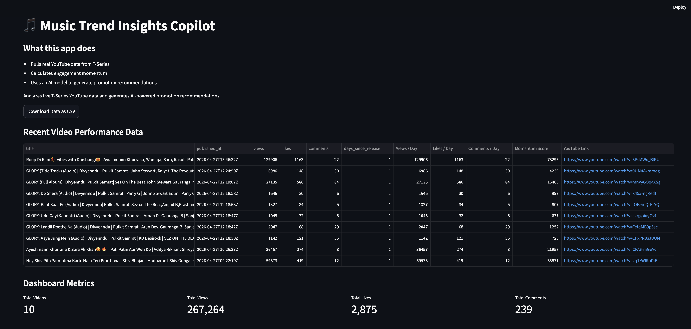
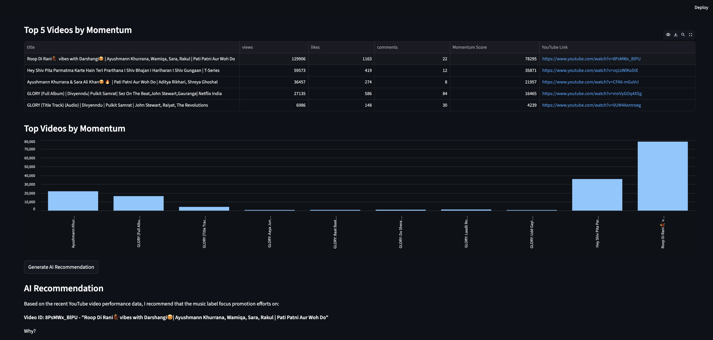
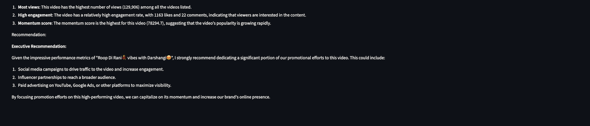

# Music Trend Insights Copilot

A lightweight data + AI project that analyzes recent T-Series YouTube videos and identifies which videos have the strongest current momentum.

## What it does

- Pulls live public YouTube data
- Collects views, likes, comments, and publish date
- Calculates views/day, likes/day, comments/day
- Creates a custom momentum score
- Gives an executive-style recommendation on what to promote next

## Why this matters

Music labels release many songs and videos. Business teams need a quick way to identify which content is gaining traction and deserves more marketing focus.

## Tech Stack

- Python
- YouTube Data API v3
- Pandas
- Ollama
- Llama 3 open-source LLM

## App Preview

 
 


## Architecture

```text
YouTube Data API
      ↓
Python Data Pipeline
      ↓
CSV Dataset
      ↓
Momentum Score Calculation
      ↓
Streamlit Dashboard
      ↓
Ollama + Llama 3
      ↓
AI Promotion Recommendation
```

## Demo Flow

1. Fetch live T-Series YouTube data.
2. Calculate engagement and momentum metrics.
3. Train a Random Forest model to classify promotion priority.
4. Open the Streamlit dashboard.
5. Review top videos, ML priority, and AI-generated recommendation.

## How to run

```bash
./venv/bin/python fetch_youtube_data.py
./venv/bin/python analyze_music_trends.py
./venv/bin/python ai_insights.py
```

## Train the ML Model

```bash
./venv/bin/python train_model.py
```
This creates:

promotion_priority_model.pkl
model_features.pkl
tseries_music_data_with_labels.csv

## Run the Streamlit App

```bash
./venv/bin/python -m streamlit run app.py
```

## AI Layer

This project uses a local open-source LLM through Ollama to generate executive-friendly recommendations from live YouTube performance data.

## Machine Learning Layer

The project includes a trained Random Forest classifier that predicts promotion priority as High, Medium, or Low using engineered YouTube performance features.

Features used:

- Views
- Likes
- Comments
- Days since release
- Views per day
- Likes per day
- Comments per day
- Momentum score

The ML prediction is then shown in the Streamlit dashboard and used by the LLM to generate a business recommendation.

## Environment Setup

Create a `.env` file locally:

```bash
cp .env.example .env
```

## Limitations

- Uses only public YouTube data.
- Does not include private analytics like watch time, CTR, revenue, retention, or demographics.
- Momentum score is a simple heuristic, not a trained prediction model.
- AI recommendations are generated from available metrics and should be used as decision support, not final business truth.